# ARQUITECTURA DEL SISTEMA - CONTROL PERSONAL CAMPO
**Versión:** 1.5.0  
**Fecha:** 2026-09-19  
**Tipo:** Documentación de Arquitectura Interactiva

---

## 📊 Diagrama de Arquitectura Completa

```mermaid
graph TB
    subgraph "FRONTEND - Capa de Presentación"
        A[index.html] --> B[app.js - Router SPA]
        B --> C[ModuloDashboard]
        B --> D[ModuloPersonal]
        B --> E[ModuloAsistencia]
        B --> F[ModuloCampo]
        B --> G[ModuloReportes]
        B --> H[ModuloAjustes]
    end

    subgraph "CAPA DE LÓGICA DE NEGOCIO"
        I[api.js - API CRUD] --> J[firebase-client.js]
        C --> I
        D --> I
        E --> I
        F --> I
        G --> I
        H --> I
    end

    subgraph "SERVICIOS Y UTILIDADES"
        K[AppState - Estado Global]
        L[Alerts - Notificaciones]
        M[QRGenerator - Generación QR]
        N[CameraSession - Gestión Cámaras]
        O[GPS - Geolocalización]
        P[Validators - Validación Datos]
        Q[PDFBuilder - Generación PDF]
        R[DataExport - Exportación Datos]
        S[CacheManager - Gestión Caché]
        T[AIEngine - Diagnóstico IA]
        U[AIPredictor - Predicción IA]
    end

    subgraph "SINCRONIZACIÓN OFFLINE"
        V[localStorage - Almacenamiento Local]
        W[OFFLINE_QUEUE - Cola Sincronización]
        X[SYNC_INDICATOR - Indicador Estado]
        Y[Service Worker - PWA]
    end

    subgraph "BACKEND - Firebase"
        Z[firebase-config.js]
        AA[Firestore - Base de Datos]
        AB[Authentication - Auth]
        AC[Cloud Functions - Funciones Backend]
    end

    subgraph "ALMACENAMIENTO EXTERNO"
        AD[Firestore Database]
        AE[Firebase Storage]
        AF[Google Apps Script - Opcional]
    end

    I --> K
    I --> L
    I --> M
    I --> N
    I --> O
    I --> P
    I --> Q
    I --> R
    I --> S
    I --> T
    I --> U

    I --> V
    I --> W
    V --> X
    Y --> V

    J --> Z
    J --> AA
    J --> AB
    J --> AC

    W --> AA
    W --> AC

    AA --> AD
    AC --> AE
    AC --> AF

    style A fill:#e1f5ff
    style B fill:#fff4e6
    style I fill:#f0f0f0
    style J fill:#ffe6e6
    style V fill:#e6ffe6
    style AA fill:#ffe6cc
    style AD fill:#e6e6ff
```

---

## 🔄 Flujo de Datos Detallado

### 1. Inicialización del Sistema

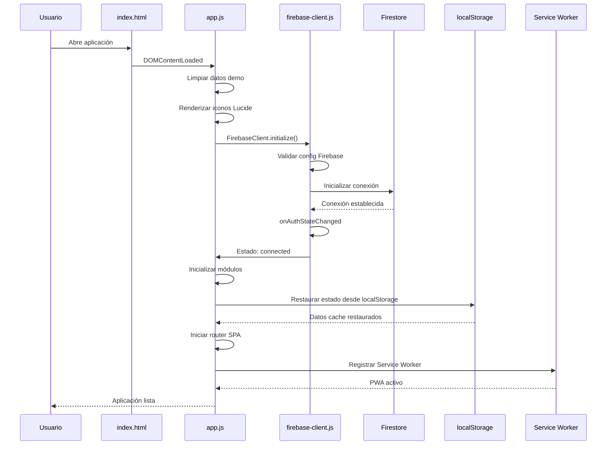

### 2. Flujo de Registro de Personal

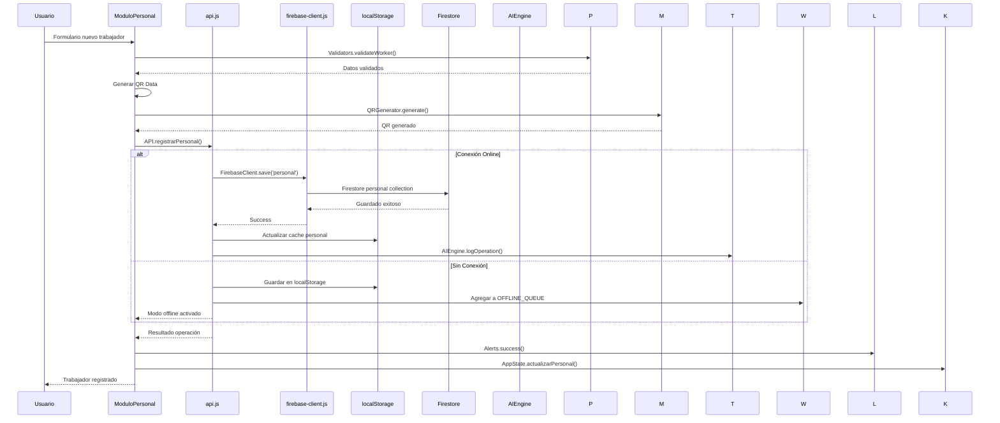

### 3. Flujo de Marcación de Asistencia

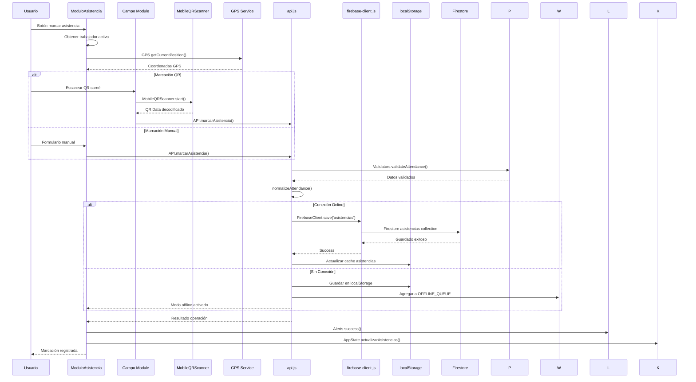

### 4. Flujo de Sincronización Offline

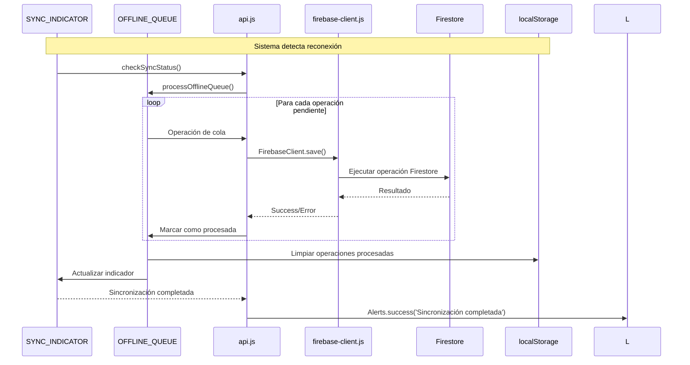

### 5. Flujo de Consulta y Visualización

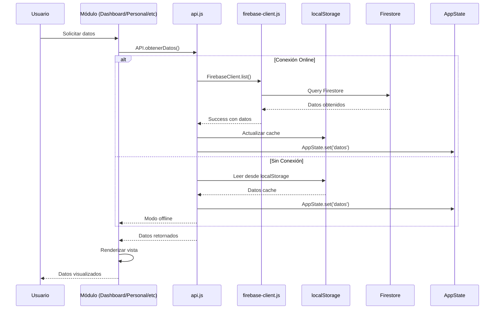

---

## 🗄️ Modelo de Datos y Almacenamiento

### Estructura de Base de Datos Firestore

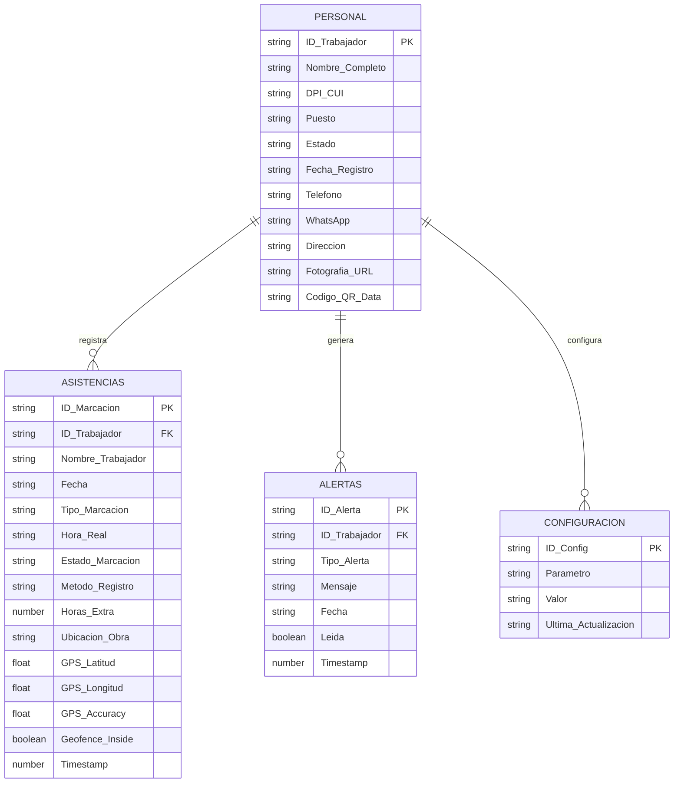

### Estrategia de Almacenamiento Local

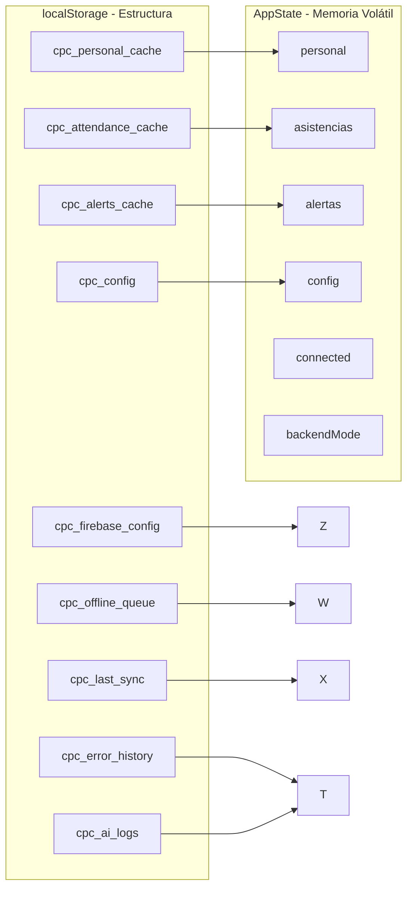

---

## 🔐 Flujo de Autenticación y Seguridad

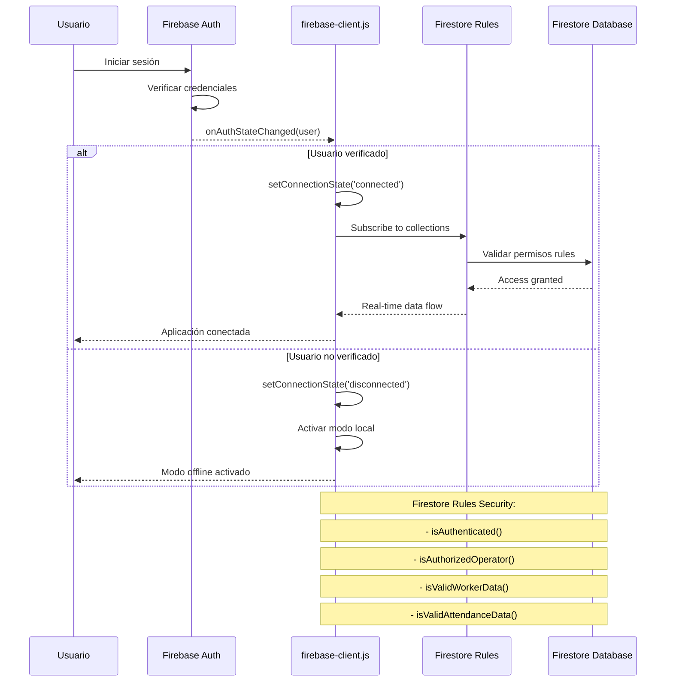

---

## 📱 Arquitectura PWA y Service Worker

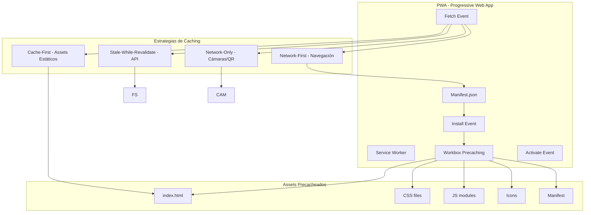

---

## 🤖 Arquitectura de Inteligencia Artificial

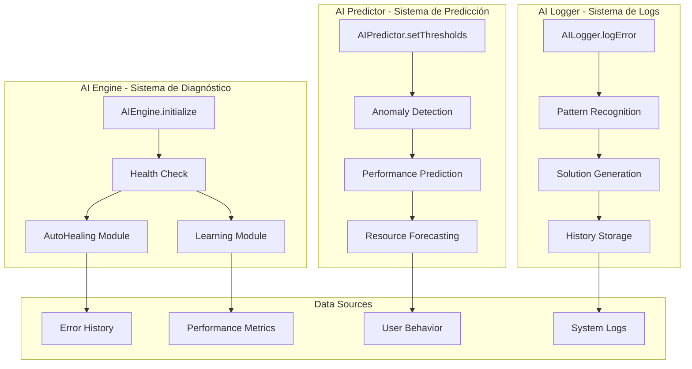

---

## 🔄 Ciclo de Vida de Datos

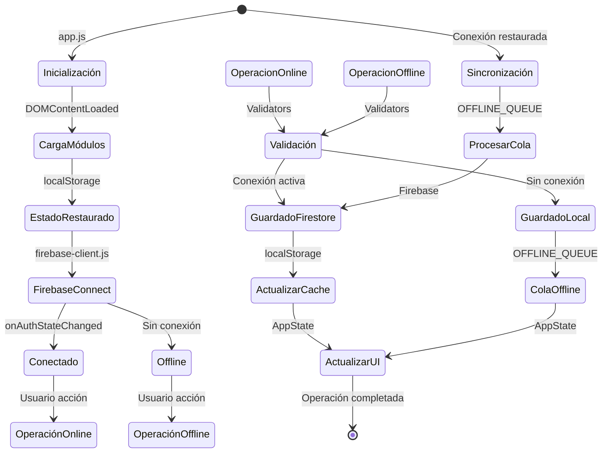

---

## 📊 Métricas y Monitoreo

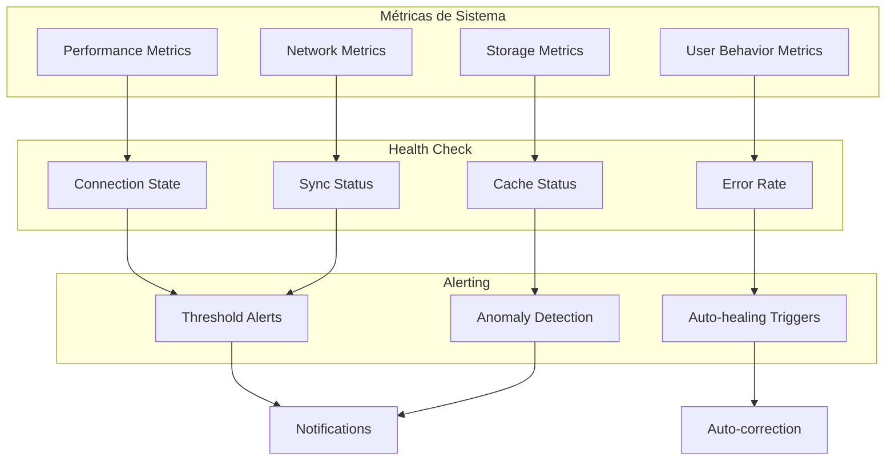

---

## 🎯 Conclusiones de Arquitectura

### ✅ Fortalezas del Diseño

1. **Offline-First**: Sistema robusto que funciona sin conexión
2. **Sincronización Automática**: Cola de operaciones para reconexión
3. **Real-time Updates**: Listeners nativos de Firebase
4. **Modularidad**: Separación clara de responsabilidades
5. **Escalabilidad**: Arquitectura preparada para crecimiento
6. **Seguridad**: Validación de datos en múltiples capas
7. **PWA**: Funciona como app nativa instalable
8. **AI Integration**: Diagnóstico y predicción de problemas

### 🔒 Seguridad de Datos

- **Firebase Rules**: Validación a nivel de base de datos
- **Input Validation**: Validación en frontend y backend
- **Authentication**: Requiere email verificado
- **Role-Based Access**: Control de acceso por roles
- **CSP**: Content Security Policy configurado
- **HTTPS**: Requerido para cámaras y GPS

### 📱 Optimización Móvil

- **Responsive Design**: Adaptado a múltiples tamaños
- **PWA**: Instalable como app nativa
- **Camera Optimizations**: Ajustes específicos por dispositivo
- **Touch Targets**: Tamaño mínimo 44px para accesibilidad
- **Performance**: Service Worker para caching inteligente

---

**Fin de Documentación de Arquitectura Completa**